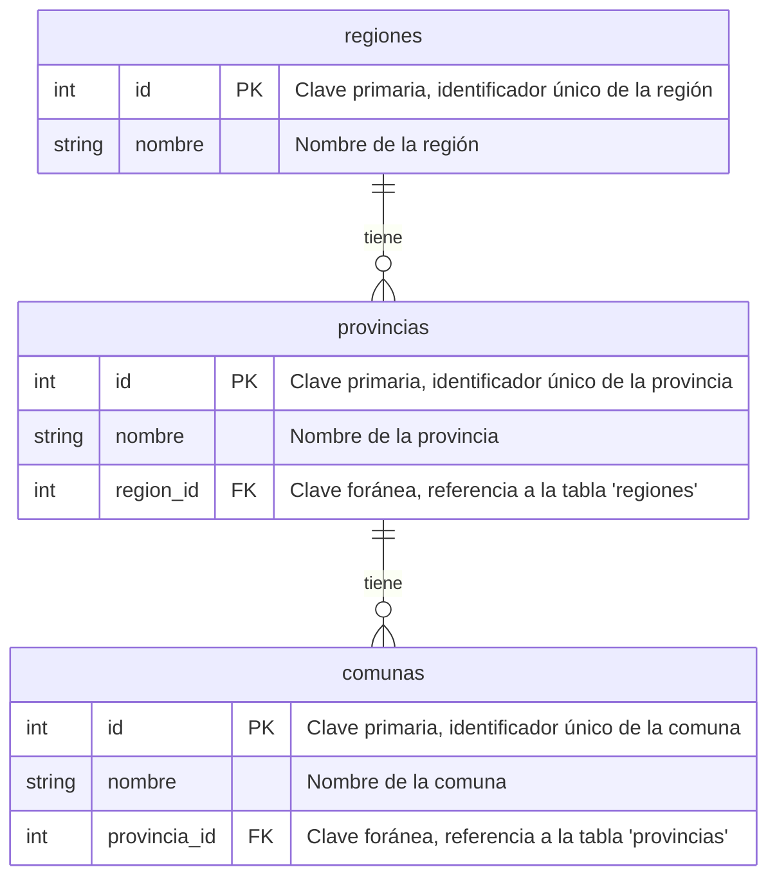

# Ejercicios de SQL con `INNER JOIN`, `LEFT JOIN`, y `RIGHT JOIN`

En este conjunto de ejercicios, trabajaremos con una base de datos que modela la estructura administrativa de Chile, dividida en **regiones**, **provincias**, y **comunas**. 

Cada tabla tiene la siguiente estructura básica:

- **regiones**:
  - `id`: Identificador único de la región.
  - `nombre`: Nombre de la región.

- **provincias**:
  - `id`: Identificador único de la provincia.
  - `nombre`: Nombre de la provincia.
  - `region_id`: Identificador de la región a la que pertenece (clave foránea a `regiones`).

- **comunas**:
  - `id`: Identificador único de la comuna.
  - `nombre`: Nombre de la comuna.
  - `provincia_id`: Identificador de la provincia a la que pertenece (clave foránea a `provincias`).



## Repaso a `INNER JOIN`, `LEFT JOIN`, y `RIGHT JOIN`

En SQL, los **joins** se utilizan para combinar filas de dos o más tablas basadas en una columna relacionada entre ellas.

- **`INNER JOIN`**: Retorna solo las filas donde existe una coincidencia en ambas tablas.
- **`LEFT JOIN`**: Retorna todas las filas de la tabla izquierda y las filas coincidentes de la tabla derecha. Si no hay coincidencia, el resultado incluirá `NULL` para las columnas de la tabla derecha.
- **`RIGHT JOIN`**: Retorna todas las filas de la tabla derecha y las filas coincidentes de la tabla izquierda. Si no hay coincidencia, el resultado incluirá `NULL` para las columnas de la tabla izquierda.

Estos conceptos se aplicarán a los siguientes ejercicios.

## Ejercicios a desarrollar en la clase, con ayuda!

### 1. Listar todas las comunas junto con sus respectivas provincias y regiones.
**Instrucciones**: Mostrar el nombre de la comuna, el nombre de la provincia, y el nombre de la región.

### 2. Mostrar todas las provincias junto con sus respectivas regiones.
**Instrucciones**: Incluir también las regiones que no tienen provincias asociadas.

### 3. Mostrar todas las regiones junto con sus provincias y comunas, si las tienen.
**Instrucciones**: Incluir también las provincias y comunas que no tienen registros asociados en las otras tablas.

### 4. Listar todas las comunas que pertenecen a una región específica, por ejemplo, la región "Metropolitana".
**Instrucciones**: Mostrar el nombre de la comuna, el nombre de la provincia, y el nombre de la región.

### 5. Mostrar la cantidad de provincias que tiene cada región.
**Instrucciones**: Incluir también las regiones que no tienen provincias asociadas.

### 6. Mostrar la cantidad de comunas que tiene cada provincia.
**Instrucciones**: Incluir también las provincias que no tienen comunas asociadas.

### 7. Listar las comunas que no tienen una provincia asociada (si existe algún caso así).
**Instrucciones**: Mostrar el nombre de la comuna.

### 8. Listar todas las provincias que no tienen comunas asociadas.
**Instrucciones**: Mostrar el nombre de la provincia.

### 9. Mostrar todas las comunas, junto con el nombre de su provincia y su región, ordenadas por región y luego por provincia.
**Instrucciones**: Mostrar el nombre de la comuna, el nombre de la provincia, y el nombre de la región.

### 10. Mostrar todas las regiones y las provincias que pertenecen a ellas, ordenadas por el nombre de la región.
**Instrucciones**: Mostrar el nombre de la región y el nombre de la provincia.

---


### Soluciones en SQL

```sql

SELECT * FROM regiones
SELECT * FROM provincias
SELECT * FROM comunas

--EJ 1
SELECT com.comuna_nombre,
pro.provincia_nombre, 
reg.region_nombre
FROM comunas AS com

INNER JOIN provincias AS pro 
ON com.provincia_id = pro.provincia_id

INNER JOIN regiones AS reg 
ON pro.region_id = reg.region_id

-- EJ 2 **** ELIMINAR TRUNCATE DE TABLAS

SELECT reg.region_nombre, pro.provincia_nombre
FROM provincias AS pro
LEFT JOIN regiones AS reg ON pro.region_id = reg.region_id

-- EJ 3 Mostrar todas las regiones junto 
-- con sus provincias y comunas, si las tienen.

SELECT reg.region_nombre, pro.provincia_nombre, com.comuna_nombre
FROM regiones AS reg
LEFT JOIN provincias AS pro ON reg.region_id = pro.region_id
LEFT JOIN comunas AS com ON pro.provincia_id = com.provincia_id

-- EJ 4 Mostrar todas las regiones junto 
-- con sus provincias y comunas, de la region metropolitana

SELECT com.comuna_nombre,pro.provincia_nombre, reg.region_nombre 
FROM comunas AS com
INNER JOIN provincias AS pro ON com.provincia_id = pro.provincia_id
INNER JOIN regiones AS reg ON pro.region_id = reg.region_id
WHERE reg.region_nombre ILIKE '%metropolitana%'

-- EJ 5 mostrar la cantidad de provincias que tiene
-- cada region + provincias sin region

SELECT reg.region_nombre, COUNT(pro.provincia_nombre) AS cantProvincias
FROM regiones AS reg
RIGHT JOIN provincias AS pro ON reg.region_id = pro.region_id
GROUP BY reg.region_nombre

-- EJ 6 provincias y la cantidad de comunas

SELECT pro.provincia_nombre, COUNT(com.comuna_id) AS cant_comunas
FROM provincias AS pro
LEFT JOIN comunas AS com ON com.provincia_id = pro.provincia_id
GROUP BY pro.provincia_nombre
ORDER BY cant_comunas DESC


```